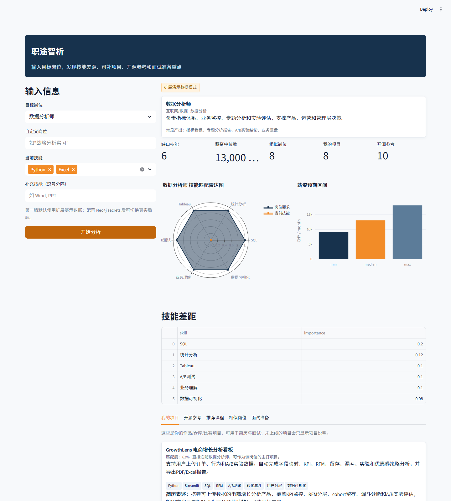

# 职途智析 职位图谱推荐系统作品集

输入目标岗位和当前技能，输出技能差距、薪资预期、课程推荐、GitHub开源项目和面试准备重点

- 角色：产品设计 / 职位图谱规则引擎 / Streamlit 产品化 / 部署准备
- 在线访问：https://career-intel.streamlit.app/
- GitHub：https://github.com/linjiayi497-max/Job-Market-Intelligence-Graph-Based-Career-Recommendation-Engine
- 项目一句话：将岗位-技能-课程-GitHub开源项目关系封装为统一 analyze_career 接口，用扩展演示数据保证公网可用，并预留 Neo4j、XGBoost 和 NER 模型接入。

## 1. 产品定位与用户问题

- 目标用户：准备投递数据分析、商业分析、产品、运营、证券研究、投行、基金、风控、ESG和咨询方向实习的学生。
- 核心问题：求职者很难把 JD、个人技能、课程学习和相似岗位机会放到同一张图里判断。
- 产品目标：输入目标岗位和当前技能，即可获得技能差距、薪资区间、课程补齐路径、可横向投递岗位、GitHub开源参考项目和面试追问。
- 可信边界：第一版明确标识“扩展演示数据模式”，避免把 demo 误导成完整真实后端。

## 2. 产品流程

| 阶段 | 产品动作 |
| --- | --- |
| 输入 | 选择目标岗位，勾选当前技能，并可补充 Wind、PPT、SQL 等自定义技能。 |
| 分析 | 统一调用 analyze_career(target_job, user_skills)，不让前端直接关心图谱或模型细节。 |
| 匹配 | 比较目标岗位技能权重与用户已有技能，生成 skill_gap。 |
| 推荐 | 按缺口技能匹配课程，同时根据岗位技能重叠度返回 similar_jobs，并从GitHub开源项目库匹配可参考项目。 |
| 展示 | 用雷达图、薪资柱状图、课程卡片、GitHub项目卡片、相似岗位卡片和面试问题组织结果。 |

## 3. 核心界面展示

结果页同时给出模式标识、岗位画像、缺口技能数量、薪资中位数、相似岗位数量、GitHub项目和技能差距表，适合在面试中现场演示产品闭环。

## 4. 统一 API 输出

| 字段 | 说明 |
| --- | --- |
| skill_gap | 目标岗位所需但用户缺少的技能列表，每个技能带 importance 权重。 |
| salary_range | 薪资区间，包含 min、median、max、currency、period。 |
| recommended_courses | 补齐技能差距的课程列表，包含课程名、平台和覆盖技能。 |
| similar_jobs | 按技能重叠度返回相似岗位及 match_score。 |
| reference_projects | 从GitHub开源项目库中选择最适合该岗位的参考项目，返回匹配理由、项目摘要、技能标签和项目链接。 |
| interview_questions | 结合岗位要求和技能差距生成可能被追问的问题。 |
| learning_plan | 基于高权重缺口技能给出补强路径。 |
| mode | 返回 demo 或 neo4j，明确当前运行后端。 |

## 5. 数据层与模型策略

- demo_assets 存放岗位-技能-课程-GitHub开源项目样例数据，保证公网部署无需重型模型文件。
- DemoCareerAdapter 负责岗位匹配、技能差距计算、课程推荐、GitHub项目推荐、相似岗位排序和面试问题生成。
- Neo4jCareerAdapter 预留真实图谱后端入口，secrets 完整时可切换真实后端模式。
- 无 XGBoost 模型时使用 demo 薪资分布；无 NER 模型时使用预设技能库和关键词匹配。
- 接口 schema 固定，便于未来替换后端模型而不重写前端。

## 6. 技术架构

| 层级 | 实现 |
| --- | --- |
| 前端 | Streamlit 页面，左侧输入，右侧结果，Plotly 雷达图、薪资柱状图、GitHub项目卡片和面试准备页签。 |
| 服务层 | career_service.py 封装 analyze_career、available_jobs、available_skills、available_projects。 |
| 适配器 | DemoCareerAdapter 和 Neo4jCareerAdapter 分离演示数据与真实图谱接入。 |
| 部署 | requirements.txt 精简为 Streamlit Cloud 可部署依赖，secrets.example.toml 提供配置模板。 |
| 测试 | 覆盖空岗位、未知岗位、空技能、完整技能匹配和固定 schema。 |

## 7. Demo 结果口径

- 以“数据分析师 + Python/Excel”为例，系统识别 6 个缺口技能，给出 13,000 元/月薪资中位数、8 个相似岗位和 10 个GitHub参考项目。
- 扩展演示数据包含 38 个岗位样例、83 个技能标签和 23 个GitHub开源参考项目。
- 课程推荐聚焦 SQL、统计分析、Tableau、A/B 测试、业务理解和数据可视化等可补齐技能。
- GitHub项目推荐会把 Superset、Metabase、PostHog、GrowthBook、dbt、Qlib、XGBoost 等开源项目按岗位要求排序。

## 8. 产品亮点

- 把原本偏研究/分析的职位图谱项目，落成可在线访问的职业规划与GitHub开源项目参考工具。
- 通过 adapter 设计把前端产品体验与后端图谱/模型解耦。
- 明确展示运行模式，让 demo 可公开演示且不夸大真实后端能力。
- 把GitHub开源项目接入推荐逻辑，能直接回答“这个岗位我该参考哪些成熟项目”。
- 输出结构天然适合后续扩展到简历 JD 匹配、学习路径推荐和投递策略建议。

## 9. 面试可讲点与后续迭代

- 如何定义岗位、技能、课程之间的图谱关系和权重。
- 为什么产品第一版选择 demo fallback，而不是强依赖 Neo4j 和深度学习模型。
- 如何用 XGBoost 薪资模型、NER 技能抽取和 Neo4j 图谱逐步替换规则引擎。
- 后续可接入实时 JD 抓取、用户画像、技能学习进度和多岗位投递推荐。
