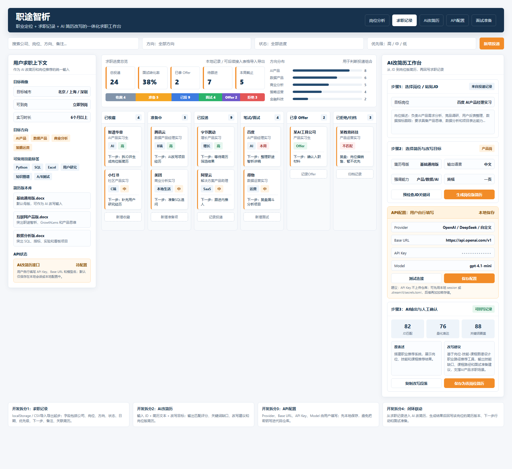

# 项目概览

## 职途智析

把岗位 JD、个人技能、课程补齐、开源项目和面试准备串成一条可解释的求职决策链路。

- 角色：产品设计 / 数据产品 / Streamlit MVP
- 方向：AI + 职业发展 + 教育科技
- 在线 Demo：`career-intel.streamlit.app`
- GitHub：`Job-Market-Intelligence-Graph-Based-Career-Recommendation-Engine`

{width=63%}

# 用户问题

## 学生真正卡住的不是“没有资源”

而是不知道如何把这些信息连接起来：

> “我该投什么？我差哪些技能？该补哪门课？怎么把学习变成简历和面试证据？”

- 招聘 JD、课程平台、经验帖、简历模板分散在不同场景
- 岗位技能词难以转译成可执行的学习路径和项目方向
- 就业指导需要一个低门槛、可解释、可演示的产品入口
- 原论文方向偏 NER / 知识图谱，需要转化成用户能用的产品闭环

# 解决方案

## 从目标岗位出发，输出下一步求职行动

| 阶段 | 产品动作 | 用户价值 |
| --- | --- | --- |
| 1. 输入目标 | 选择目标岗位、填写已有技能或粘贴 JD | 明确分析对象 |
| 2. 识别差距 | 按岗位技能权重计算缺口 | 知道具体差在哪 |
| 3. 推荐路径 | 匹配课程、项目和相似岗位 | 得到补齐路线 |
| 4. 准备表达 | 生成面试追问和项目讲述方向 | 转成投递材料 |
| 5. 形成闭环 | 沉淀求职记录、简历版本、AI 改写 | 长期管理求职动作 |

# 我的角色与取舍

## 我负责把论文/算法方向产品化成可在线演示的 MVP

### 我做了什么

- 需求定义：从就业动员反馈拆出核心任务
- 产品设计：设计岗位画像、技能缺口、课程和项目推荐
- 数据产品：定义岗位、技能、课程、项目和推荐解释字段
- MVP 落地：用 Streamlit 搭建在线 Demo

### 关键取舍

- 先验证完整用户路径，而不是先追求完整模型
- 明确 demo / neo4j 模式，避免夸大真实后端能力
- 加入 GitHub 项目推荐，让学习路径能转成作品集证据
- 用统一接口给后续 NER、Neo4j、薪资模型留扩展空间

# 核心界面

## 一屏讲清“岗位要求 → 能力缺口 → 行动建议”

{width=83%}

- 顶部展示岗位画像与关键指标，降低用户理解成本
- 中部用雷达图和薪资图建立直观判断
- 下方用 Tab 承载课程、项目、相似岗位和面试准备

# 新增板块总览

## 从单次分析工具升级为一体化求职工作台

{width=90%}

- 左侧：用户求职上下文，作为岗位分析、AI 改简历和投递记录的统一输入
- 中间：求职记录看板，管理投递阶段、优先级、截止日期和下一步行动
- 右侧：AI 改简历工作台，串联 JD、简历版本、API 配置和人工确认

# 用户求职上下文

## 把“用户是谁、想去哪、能做什么”结构化

- 基本画像：默认使用通用人物“李华”，避免把真实个人信息写进模板
- 目标城市：中国 34 个省级行政区 + 对应城市联动下拉
- 目标方向：参考 BOSS 直聘职位分类，覆盖技术、产品、运营、销售、职能、设计、医疗、金融等方向
- 能力标签：按语言、计算机、数据/AI、产品运营、设计传媒、财务职能、制造工程、通用能力分组
- 简历版本：上传 1-10 个 PDF，只读取文件名，作为后续投递记录的版本选项

# 求职记录看板

## 把“想投、准备、已投、面试、Offer、归档”做成可追踪流程

- 新增记录：公司、岗位、方向、状态、优先级、截止日期、下一步行动
- 简历绑定：从已上传 PDF 文件名中下拉选择，明确每个岗位用了哪版简历
- 方向搜索：方向字段支持关键词输入，可快速筛选 AI、产品、运营、金融等岗位
- 看板流转：点击进入下一阶段，低成本维护投递进度
- 导入导出：JSON 导入 / 导出，保证本地可迁移、可备份

# AI 改简历工作台

## 从“生成文本”改成“岗位版简历生产流程”

- 选择岗位 / 粘贴 JD：可从求职记录读取，也可手动粘贴，避免只凭岗位名泛泛改写
- 上传或粘贴简历：支持 docx / txt / md 文本读取，要求保留真实经历
- 改写配置：选择输出语言、目标篇幅和强调能力，让结果服务不同投递场景
- 本地预览 / AI 调用：没有 API Key 时也能先看规则建议
- 人工确认与保存：改写结果可保存回该岗位记录，成为投递流程的一部分

# API 配置与安全边界

## 让用户自己配置模型，同时不把密钥写入仓库

- API Key 只保存在当前 Streamlit 会话状态中
- 支持 OpenAI-compatible `/chat/completions` 接口
- Base URL、Model、Temperature、Timeout 可配置
- 提供测试连接按钮，先验证接口再进入 AI 改写
- Prompt 明确要求：基于真实简历事实，不编造学校、公司、奖项、实习或量化结果

# 产品架构

## 统一接口让前端体验和后端模型解耦

- 输入层：目标岗位、当前技能、JD 文本、求职记录和简历版本
- 服务层：`analyze_career(target_job, user_skills)` 固定输入输出 schema
- 适配器：`DemoCareerAdapter` 保证公网稳定，`Neo4jCareerAdapter` 预留真实图谱
- 推荐层：技能缺口、课程、相似岗位、GitHub 项目和面试问题排序
- 展示层：Streamlit 页面、Plotly 图表、卡片和 Tab 组织复杂结果
- 扩展层：NER 技能抽取、XGBoost 薪资预测、SHAP 解释和真实 JD 数据

# 推荐逻辑

## 推荐围绕缺口技能给理由

### 当前 MVP

- 38 个岗位样例
- 83 个技能标签
- 23 个 GitHub 开源参考项目
- 7 个核心输出模块

### 计算思路

- 技能缺口：目标岗位技能集合 - 用户已有技能集合
- 课程推荐：按缺口技能覆盖范围排序
- 项目推荐：按岗位适配度和技能重叠度排序
- 相似岗位：按岗位技能集合重叠度排序

# 求职工作台扩展

## 新旧能力如何合成完整闭环

- 岗位分析：从目标岗位和已有技能出发，识别缺口和学习路径
- 求职记录看板：记录投递状态、截止日期、优先级和下一步行动
- 用户求职上下文：统一维护目标城市、岗位方向、能力标签和简历 PDF 版本
- AI 改简历：读取 JD、原始简历和用户上下文，生成岗位定制版改写建议
- API 配置：支持用户自行配置 OpenAI-compatible 接口，不把 Key 写入仓库
- 面试准备：把岗位分析和简历改写结果转成可追问的问题

> 产品边界从“推荐你学什么”推进到“帮你管理投递、定制简历、准备面试”。

# 当前成果

## 可展示结果和可信边界

| 维度 | 结果 |
| --- | --- |
| 示例缺口技能 | 6 个 |
| 示例薪资中位数 | 13,000 元 / 月 |
| 相似岗位推荐 | 8 个 |
| GitHub 项目推荐 | 10 个 |
| 部署方式 | Streamlit Cloud 可在线访问 |
| 可信边界 | 明确展示 demo / neo4j 模式，不把样例数据包装成生产系统 |

# 面试讲法

## 从真实问题到可运行产品

### 30 秒版本

职途智析是我基于就业动员反馈和 NER 论文方向做的职业路径推荐产品。它解决学生看不懂 JD、课程和自身技能关系的问题。用户输入目标岗位和已有技能后，系统输出技能缺口、课程推荐、相似岗位、GitHub 项目和面试准备问题。

### 可追问点

- 为什么第一版选择 demo fallback
- 如何定义岗位、技能、课程之间的权重关系
- 后续如何接入 NER、Neo4j 和薪资预测模型
- 为什么把 GitHub 项目推荐加入求职闭环
